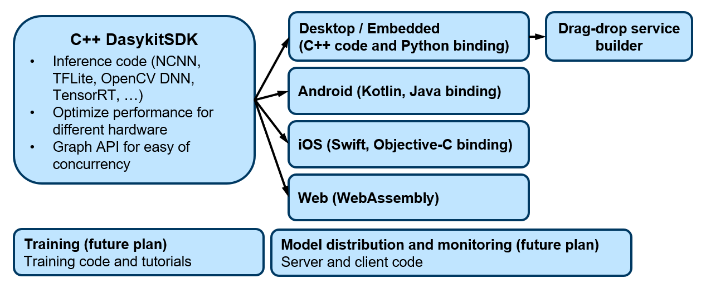

# Daisykit

Daisykit is an AI toolkit for software engineers to Deploy AI Systems Yourself (DAISY). We develop this package with a focus on the ease of deployment. This repository contains:

- Daisykit SDK, the core of models and algorithms.
- Daisykit Python.

**Website:** <https://daisykit.org/>.



**Our development plan for Daisykit. We are working to build the whole system gradually.**

## Environment Setup

For Ubuntu, we need build tools from `build-essential` package. For Windows, Visual Studio 2019 is recommended.

- Install OpenCV.

**Ubuntu:**

```
sudo apt install libopencv-dev
```

**Windows:**

Download and extract OpenCV from [the official website](https://opencv.org/releases/), and add `OpenCV_DIR` to path.

- Install Vulkan development package.

**Ubuntu:**

```
sudo apt install -y libvulkan-dev vulkan-utils
sudo apt install mesa-vulkan-drivers # For Intel GPU support
```

- Download [precompiled NCNN](https://github.com/Tencent/ncnn/releases), extract it (version for your development computer).

## Build and Run on PC

- Initialize / Update submodules

```
git submodule update --init
```

- Build

**Ubuntu:**

```
mkdir build
cd build
cmake .. -Dncnn_FIND_PATH="<path to ncnn lib>"
make
```

**Windows:**

```
mkdir build
cd build
cmake -G "Visual Studio 16 2019" -Dncnn_FIND_PATH="<path to ncnn lib>" ..
cmake --build . --config Release
```

- Run face detection example

**Ubuntu:**

```
./bin/demo_face_detector_graph
```

**Windows:**

```
./bin/Release/demo_face_detector_graph
```

## Coding convention

Read coding convention and contribution guidelines [here](https://docs.daisykit.org/md_contribution.html).

## Build documentation

- Step 1: Install **doxygen** first.

- Step 2: Build the documentation:

```
cd docs
doxygen Doxyfile.in
```

- Step 3: Deploy html documentation from `docs/_build/html`.

- Step 4: Our lastest documentation is deployed at <https://docs.daisykit.org>.

## Known issues and problems

**1. Slow model inference - Low FPS**

This issue can happen on development build. Add `-DCMAKE_BUILD_TYPE=Debug` to `cmake` command and build again. The FPS can be much better.

## References

This toolkit is developed on top of other source code. Including

- Toolchains setup from [ncnn](https://github.com/Tencent/ncnn).
- QR Scanner from [ZXing-CPP](https://github.com/nu-book/zxing-cpp).
- JSON support from [nlohmann/json](https://github.com/nlohmann/json).
- Pretrained AI models from different sources: <https://docs.daisykit.org/md_models.html>.
